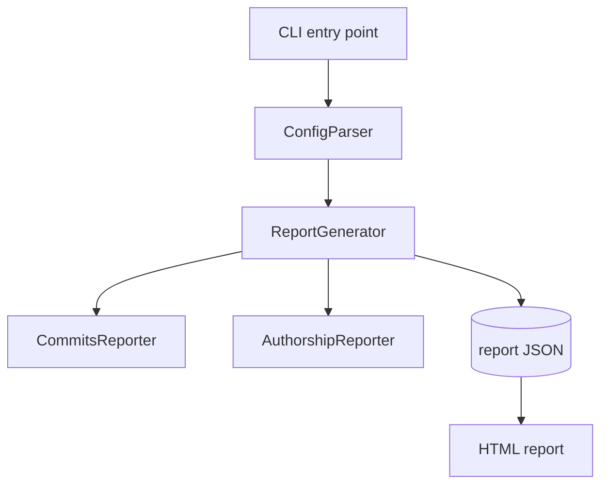
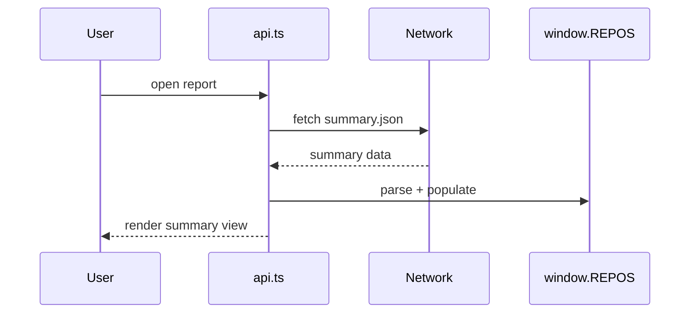
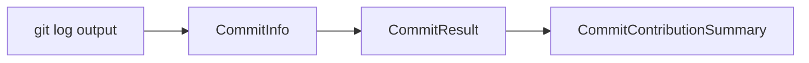
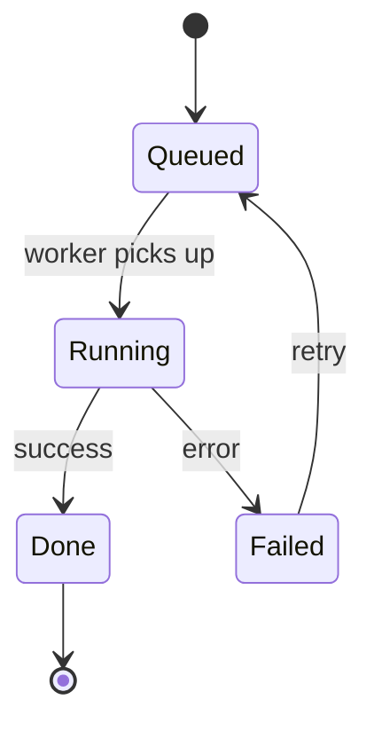
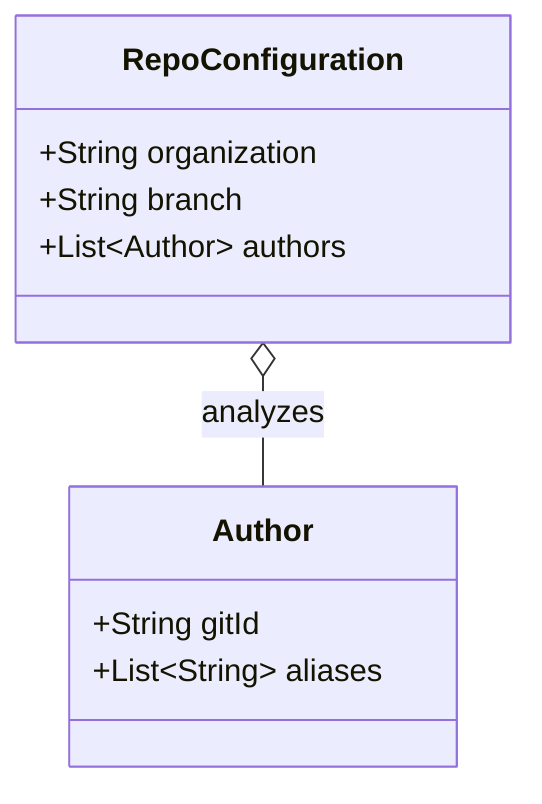
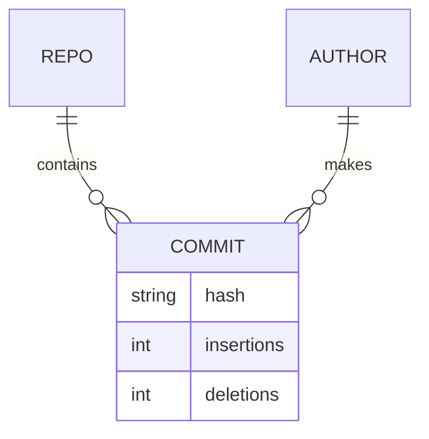

# Diagrams

Read this before authoring or editing any diagram in the guide. Choosing the wrong diagram type is
the most common way technical docs confuse rather than clarify: a sequence forced into a box-and-arrow
graph, or a whole system crammed into one chart. Each type below answers a different reader question.

Default to **Mermaid**. It lives in the markdown as text, so it diffs in pull requests, renders on
GitHub and most doc hosts, and is edited in the same pass as the prose it sits next to — which is why
it stays in sync. Committed image exports (PNG/SVG from an external tool) drift silently because
nobody re-exports them. Only prefer images if the repo already standardizes on a tool (e.g. PlantUML)
— in that case, match it.

## Table of contents

- [Selection table](#selection-table)
- [Component / architecture — `flowchart TD`](#component)
- [Sequence — `sequenceDiagram`](#sequence)
- [Data pipeline — `flowchart LR`](#pipeline)
- [State machine — `stateDiagram-v2`](#state)
- [Class / type relationships — `classDiagram`](#class)
- [Entity-relationship — `erDiagram`](#er)
- [Hygiene rules](#hygiene)

## Selection table

| Reader's question                                          | Diagram                    | Mermaid           |
|------------------------------------------------------------|----------------------------|-------------------|
| How do the major parts fit together?                       | Component / architecture   | `flowchart TD`    |
| What calls what, in what order, over time?                 | Sequence                   | `sequenceDiagram` |
| How is data transformed as it moves through stages?        | Data pipeline              | `flowchart LR`    |
| What states does this thing move between?                  | State machine              | `stateDiagram-v2` |
| How do the key types/classes relate (inherit, contain)?    | Class / type               | `classDiagram`    |
| What's the database / entity schema?                       | Entity-relationship        | `erDiagram`       |

## Component / architecture — `flowchart TD`

**Use when** showing the static structure of the system: the major components and their dependency or
data-handoff relationships. This is the keystone diagram of the architecture overview.

**Avoid when** the thing you're describing is fundamentally ordered in time (use a sequence) or is a
linear transformation of data (use a pipeline, below).

Use `[(label)]` for data stores/artifacts and `[label]` for components so the reader can tell a
producer from a product at a glance. Label edges (`A -->|loads| B`) when the relationship isn't
obvious from position.

## Sequence — `sequenceDiagram`

**Use when** the point is *order of interaction over time*: a request lifecycle, an auth handshake, a
call chain across modules. If your prose uses words like "first… then… after that…", you want a
sequence diagram, not a flowchart.

**Avoid when** there's no meaningful ordering — a static set of dependencies belongs in a component
diagram.

Use `->>` for calls and `-->>` for responses/returns so the round trip is visible. Keep participants
to the few that matter for the flow being told.

## Data pipeline — `flowchart LR`

**Use when** data flows through a series of transformations and you want to show *what shape it has at
each stage*. Left-to-right reads as "data moving downstream".

**Avoid when** the components branch and interconnect richly (that's a component diagram) or call each
other back and forth over time (that's a sequence).

Naming each node after the *data type at that stage* (not the function that produces it) makes the
transformation legible and mirrors the numbered flow in the prose.

## State machine — `stateDiagram-v2`

**Use when** an entity moves between a defined set of states (a job: queued → running → done/failed;
a connection; an order). Shows legal transitions, which prose struggles to convey completely.

## Class / type relationships — `classDiagram`

**Use when** documenting the core domain types and how they relate — inheritance, composition,
references. Especially valuable for libraries/SDKs where the types *are* the architecture.

Use `<|--` for inheritance, `*--` for composition (owned), `o--` for aggregation (referenced). Show
only the fields/methods that matter for understanding the relationship — this is a map, not the full
class.

## Entity-relationship — `erDiagram`

**Use when** documenting a database or persistent-entity schema: tables/entities, their key fields,
and cardinality between them.

Cardinality notation: `||` exactly one, `o{` zero-or-many, `|{` one-or-many.

## Hygiene rules

These apply to every diagram regardless of type:

- **One diagram, one idea.** If a diagram needs a legend to be understood, it's doing too much. Split it.
- **~5–9 nodes.** Past that, readers lose the thread. Decompose a sprawling system into a high-level
  diagram plus per-subsystem diagrams.
- **Label non-obvious edges.** An unlabeled arrow says "related somehow"; `-->|validates|` says
  something. Don't label edges whose meaning is obvious from the node types.
- **Name nodes after code constructs.** Use the actual class/module/type names (the same ones the
  prose links to) so the diagram and the code are connected. Generic boxes like "Processing Layer"
  that map to nothing in the code are not useful.
- **Pick direction by semantics.** `TD` (top-down) for hierarchy/structure; `LR` (left-right) for
  pipelines and time-ordered flow.
- **A diagram that contradicts the code is a bug.** When the structure changes, the diagram changes in
  the same edit. Never leave a diagram describing a layout that no longer exists.
