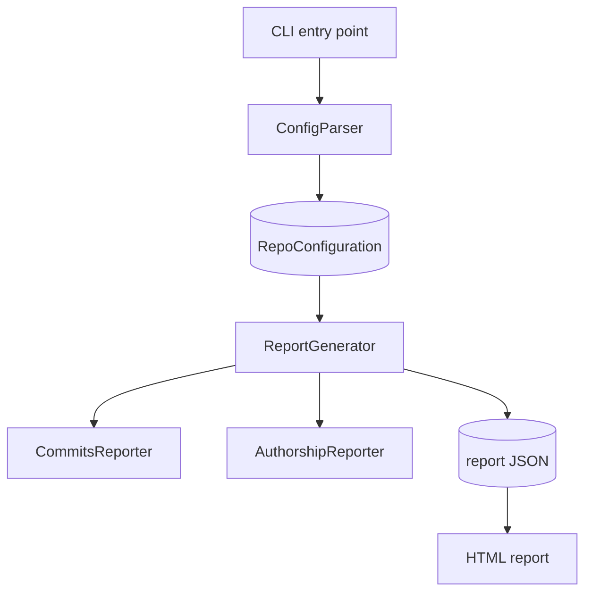

# Developer Guide Structure

Read this when laying out a new developer guide or deciding where a new section belongs.
It gives the section ordering, what each section is for, how to scale the structure to the
project, and a worked example of a filled-in component section.

## Table of contents

- [File layout: single file vs. split](#file-layout)
- [Section order and purpose](#section-order)
- [Adapting to project type](#adapting-to-project-type)
- [Worked example](#worked-example)

<a id="file-layout"></a>
## File layout: single file vs. split

- **Single file** (`docs/developer-guide.md` or `DEVELOPER.md`) suits small and medium projects —
  roughly up to a dozen major components. Everything is one scroll, easy to search.
- **Split into `docs/dg/`** when the system is large enough that one file becomes unwieldy. Mirror
  the RepoSense model: an `architecture` page for the overall structure and per-subsystem pages
  (e.g. a `frontend`/`report` page, a `backend` page). Keep a short index page that links them and
  states what each covers.

Default to a single file unless the project is clearly large or the user asks to split. Always match
an existing convention if the repo already has one.

<a id="section-order"></a>
## Section order and purpose

A developer guide reads top-down — orient the reader before drilling in.

1. **Overview** — one short paragraph: what the system does, who it's for, and the single most
   important thing to know about its shape (e.g. "a CLI that clones git repos and produces a static
   HTML contribution report"). No history, no marketing.

2. **Architecture overview** — the keystone section.
   - One **component diagram** (`flowchart TD`) of the major parts and how they connect.
   - A paragraph naming each major component in one clause and describing the overall flow through
     them ("the CLI parses config, the analyzers process each repo, the generator emits JSON, the
     frontend renders it"). This paragraph is the map; the per-component sections are the territory.

3. **Component sections** — one per major component, in the order data/control flows through them
   (entry point first). Use the component pattern from the main SKILL.md: responsibility sentence,
   parts as linked one-liners, numbered flow when there's a sequence, connections to other
   components. Add a section-level diagram only when the interaction is hard to follow in prose.

4. **Data model / shared structures** — include when the system has core types passed between
   components. Document each: what it holds, and *who uses it for what* (cross-reference the
   consumers). This is often the fastest way for a new contributor to understand the system, because
   the types encode the domain.

5. **Cross-cutting concerns** — include the ones that actually exist and matter: configuration,
   logging, error handling, concurrency/threading, authentication, persistence. Skip the ones that
   don't apply rather than writing empty headings.

6. **Key design decisions** (optional but valuable) — non-obvious choices and *why* they were made:
   "why a ZIP fallback for loading report data", "why analysis is multi-threaded per repo". This is
   the irreplaceable part — a contributor can read the code to see *what* it does but not *why* it
   was done that way. Preserve any such notes a human already wrote.

7. **Conventions / gotchas** (optional) — short, concrete rules a contributor will trip over
   otherwise ("when building shell commands with path args, always quote via `addQuotesForFilePath`";
   "components are named `c-*` and live in `views/`").

Omit any optional section that would be empty. A tight guide that covers what exists beats a
template with hollow headings.

<a id="adapting-to-project-type"></a>
## Adapting to project type

- **Library / SDK** — lead with the public surface and the core abstractions; the "components" are
  the main modules and the key types. A `classDiagram` of the core types often carries more than a
  box diagram.
- **Service / backend** — emphasize request lifecycle (`sequenceDiagram`), the layering
  (handler → service → repository), data stores (`erDiagram`), and cross-cutting concerns (auth,
  error handling, concurrency).
- **CLI / batch tool** — follow the pipeline: argument parsing → configuration → processing stages →
  output. A `flowchart LR` pipeline fits the processing path well.
- **Frontend app** — document the component tree, state management and data loading, and the flow
  from data source to rendered view. Reuse the framework's canonical lifecycle diagram rather than
  redrawing it.
- **Monorepo / multi-service** — give each service/package its own page under `docs/dg/`, plus a
  top-level diagram of how the services interact.

<a id="worked-example"></a>
## Worked example

A filled-in architecture overview plus one component section, for a hypothetical CLI that analyzes
git repos. This shows the target density and style — note that every name links to source and every
section leads with responsibility.

````markdown
## Architecture overview



RepoSense runs as a pipeline. The **CLI entry point** hands raw arguments to **ConfigParser**,
which produces a validated `RepoConfiguration`. **ReportGenerator** drives the analysis, delegating
to **CommitsReporter** (commit history) and **AuthorshipReporter** (per-line authorship), then emits
JSON consumed by the **HTML report** frontend.

## CommitsReporter

`CommitsReporter` ([src/commits/CommitsReporter.ext](path)) is responsible for analyzing a
repository's commit history into a `CommitContributionSummary` — each author's daily and weekly
contribution and its variance.

It coordinates these parts:

- `CommitInfoExtractor` ([path]): runs `git log` over the date range and emits a raw `CommitInfo`
  (info line + stat line) per commit.
- `CommitInfoAnalyzer` ([path]): parses each `CommitInfo` into a structured `CommitResult`
  (insertions, deletions, author).
- `CommitResultAggregator` ([path]): folds all `CommitResult`s into the final summary.

How it works:

1. uses `CommitInfoExtractor` to produce one `CommitInfo` per commit in range.
2. uses `CommitInfoAnalyzer` to turn each `CommitInfo` into a `CommitResult`.
3. uses `CommitResultAggregator` to aggregate the results into a `CommitContributionSummary`.

`CommitsReporter` is invoked by `ReportGenerator` once per repository and relies on the `Git`
wrapper package to run the underlying git commands.
````

The same density applies throughout: the reader can follow the data (`CommitInfo` → `CommitResult` →
`CommitContributionSummary`) and jump to any named construct via its link.
