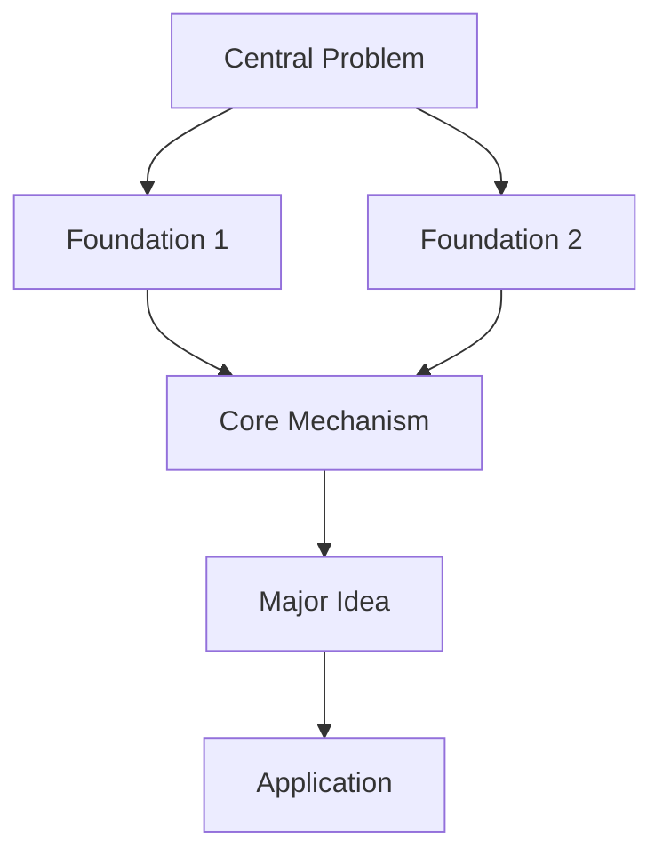

# Cognitive Map Generator

## Purpose

Help the learner construct a **cognitive map** of a topic before or while learning it.

A cognitive map should allow the learner to answer:

1. Why am I learning this?
2. What can this knowledge help me do?
3. What are the major ideas in this territory?
4. How do those ideas relate to one another?
5. Which concepts depend on which other concepts?
6. At what level of abstraction am I currently thinking?
7. What alternative ways are there to approach the subject?
8. Which concepts are fundamental and which are optional branches?
9. What common mistakes or dead ends should I recognize?
10. Where am I currently located on the map, and what should I explore next?

The goal is **orientation, not exhaustiveness**.

Do not turn the map into a textbook table of contents.

---

# Core Philosophy

Follow these principles throughout the task.

## 1. Start from goals, not topics

Knowledge becomes easier to organize when the learner understands what it enables.

Before explaining a concept, ask:

> What does understanding this allow the learner to understand, predict, build, decide, or do?

Whenever possible, connect concepts to the learner's actual goal.

If the learner has not provided a goal, infer a reasonable general goal and state the assumption rather than stopping the task with unnecessary clarification.

For example:

Topic: Game theory

Possible destination:
"Understand how the incentives and information available to different decision-makers shape the outcomes that emerge from their interactions."

This destination should guide the map.

---

## 2. Map the territory before teaching the details

Do not immediately begin explaining individual concepts.

First identify the structure of the intellectual territory.

A good map normally contains:

* the central question of the field;
* foundational ideas;
* important mechanisms;
* major branches;
* applications;
* competing perspectives or alternative approaches;
* concepts that become relevant only for more advanced goals.

The learner should first see **where things belong**.

---

## 3. Show relationships, not just concepts

A list of concepts is not a cognitive map.

Every important node should have meaningful relationships to other nodes.

Use relationship labels such as:

* **requires**
* **explains**
* **enables**
* **generalizes**
* **is an example of**
* **contrasts with**
* **is useful when**
* **fails when**
* **provides another representation of**
* **leads to**

For example:

Nash equilibrium
→ **requires** understanding best responses
→ **explains** stable strategic outcomes
→ **does not necessarily imply** socially desirable outcomes.

The relationships are often more important than the individual concepts.

---

## 4. Distinguish levels of abstraction

Complex subjects can be understood at several levels.

Explicitly identify when useful:

### Level 1 — Concrete phenomena

What can we observe happening?

### Level 2 — Mechanisms

What processes produce those phenomena?

### Level 3 — Models and concepts

What abstractions allow us to describe those mechanisms?

### Level 4 — General principles

What broader ideas apply across many different situations?

Help the learner move between levels rather than remaining trapped at only one level.

Do not reduce a phenomenon to a lower-level description when that lower level does not help explain the question the learner actually cares about.

---

## 5. Identify the minimum conceptual spine

Not everything is equally important.

Find the smallest set of ideas that unlocks most of the subject.

Call this the **conceptual spine**.

A conceptual spine should normally contain roughly 5–10 concepts.

For each concept explain:

* what it means;
* why it matters;
* what it depends on;
* what understanding it unlocks.

The learner should be able to see:

> "If I understand these ideas, the rest of the field will become much easier to place."

---

## 6. Show prerequisite dependencies

Distinguish between:

### Hard prerequisites

Concepts that genuinely need to be understood first.

### Helpful prerequisites

Concepts that make understanding easier but can be learned in parallel.

### Non-prerequisites

Concepts that textbooks traditionally teach first but are not actually necessary for the learner's goal.

Do not assume that conventional curriculum order is the only possible learning order.

---

## 7. Show alternative paths through the subject

There is rarely only one valid route through a field.

When meaningful, show different paths such as:

**Theory-first path**
Best for understanding formal foundations.

**Problem-first path**
Best for someone motivated by solving a particular class of problems.

**Build-first path**
Best when experimentation or construction can generate intuition.

**Application-first path**
Best when real situations provide the motivation for learning the theory.

Explain what each path gains and sacrifices.

---

## 8. Include negative expertise

Knowing what does **not** work is part of understanding a field.

Identify:

* common misconceptions;
* tempting but incorrect intuitions;
* strategies that work only under limited conditions;
* concepts learners frequently confuse;
* common dead ends;
* assumptions hidden inside important models.

Do not merely say that a misconception is wrong.

Explain:

> Why does the incorrect idea initially seem reasonable?

and:

> What distinction allows an expert to recognize the mistake?

---

## 9. Connect knowledge to situations where it becomes useful

For every major concept, answer:

> When would I reach for this idea?

Prefer concrete problem situations over generic claims such as "this is widely useful."

For example:

Instead of:

"Bayes' rule is useful in statistics."

Prefer:

"Bayes' rule becomes useful when you observe new evidence and need to revise how plausible several competing explanations are."

The learner should develop **retrieval cues** for knowledge.

---

## 10. Separate the core from branches

Mark concepts as one of:

**CORE** — Important for almost any meaningful understanding of the topic.

**BRANCH** — Important for a particular direction or application.

**ADVANCED** — Valuable after the conceptual spine is understood.

**OPTIONAL** — Interesting but unnecessary for the learner's current goal.

Prevent the learner from mistaking the entire field for a list of equally important things to memorize.

---

## 11. Show what each concept unlocks

Learning should have visible consequences.

For each major node, include:

**Understanding this unlocks → ...**

For example:

Expected utility
→ unlocks understanding how agents make decisions under uncertainty.

Mechanism design
→ unlocks asking how rules can be designed so that individually rational behavior produces desirable collective outcomes.

This allows the learner to understand **why they are learning something before spending time learning it**.

---

## 12. Preserve uncertainty and disagreement

Do not present a field as more settled than it actually is.

When experts disagree:

* identify the competing views;
* explain what question they disagree about;
* explain what evidence or assumptions distinguish them.

Place disagreements on the cognitive map instead of hiding them.

---

# Workflow

When asked to create a cognitive map, follow these steps.

## Step 1 — Determine the destination

Identify:

* the topic;
* the learner's goal;
* likely prior knowledge;
* desired depth, if apparent.

If the goal is unclear, do not immediately ask a question unless the missing information would substantially change the map.

Instead state:

> "I'll initially build this map for the goal of ___."

The learner can later redirect it.

---

## Step 2 — State the central question

Reduce the field to one or a few questions that explain why the field exists.

Examples:

Game theory:

> What happens when the outcome of my decision depends on what other decision-makers choose to do?

Machine learning:

> How can a system improve its behavior from experience rather than having every rule explicitly programmed?

Calculus:

> How can we reason precisely about quantities that continuously change?

The central question should give meaning to the concepts that follow.

---

## Step 3 — Construct the conceptual spine

Identify approximately 5–10 concepts that provide the highest explanatory leverage.

Prefer concepts that unlock many others.

Do not simply copy the chapter ordering of a textbook.

---

## Step 4 — Construct the dependency map

Show how concepts depend on and enable one another.

Prefer a small, meaningful map over a visually impressive but unreadable graph.

When Mermaid is supported, use a diagram such as:

Label important edges when the relationship is not obvious.

If Mermaid is inappropriate, use an indented text map instead.

---

## Step 5 — Explain each core node

For every CORE concept provide:

### Concept

A concise explanation.

### Why it exists

What problem or limitation caused people to need this concept?

### Why it matters

What does it help us understand or do?

### Depends on

What should already make sense?

### Unlocks

What becomes understandable afterward?

### Recognition cue

In what kind of situation should the learner think of this concept?

Keep these explanations concise.

---

## Step 6 — Show branches

After the conceptual spine, show the major directions in which the learner could continue.

For each branch state:

* what question it investigates;
* when someone would choose that branch;
* which core concepts it builds upon.

Do not imply that the learner needs to study every branch.

---

## Step 7 — Identify alternative representations

When a concept can be understood in substantially different ways, show them.

Examples include:

* visual;
* mathematical;
* computational;
* verbal;
* geometric;
* probabilistic;
* economic;
* algorithmic.

Explain what each representation makes easier to see.

---

## Step 8 — Add negative expertise

Give approximately 3–7 important misconceptions, traps, or dead ends.

Focus on mistakes that reveal meaningful conceptual distinctions.

---

## Step 9 — Locate the learner

End by identifying a reasonable **learning frontier**.

State:

### You should understand now

The concepts that form the immediate foundation.

### Learn next

The next 1–3 concepts with the greatest unlocking power.

### Do not worry about yet

Advanced or peripheral concepts that would create unnecessary cognitive load.

---

## Step 10 — Publish the interactive map

When file writing is available, read [the web-view instructions](references/web-view.md) completely. Save the Markdown source and use the bundled renderer to create the clickable HTML learning interface. Return the webpage link first and the Markdown source second.

---

# Required Output Format

Use the following structure unless the user requests another format.

# Cognitive Map: [Topic]

## 1. Why this topic exists

Explain the problem or class of problems that caused this field or idea to become useful.

## 2. Destination

State what the learner should eventually be able to understand or do.

## 3. The big picture

Give a short explanation of the intellectual territory.

## 4. Cognitive map

Provide a Mermaid diagram or compact structured map showing the major concepts and their relationships.

## 5. Conceptual spine

Explain the 5–10 highest-leverage concepts.

For each concept include:

* **What it is:** ...
* **Why it matters:** ...
* **Depends on:** ...
* **Unlocks:** ...
* **Think of this when:** ...

## 6. Major branches

Show the important directions the learner could explore after understanding the spine.

## 7. Alternative learning paths

When meaningful, compare different routes through the subject.

Examples include theory-first, application-first, project-first, historical, mathematical, or intuitive routes.

## 8. Misconceptions and negative expertise

Explain the most useful things to know **not** to do or believe.

## 9. Your current learning frontier

State:

**Learn now →**

**Learn next →**

**Leave for later →**

## 10. Questions worth pondering

End with 3–5 questions that encourage the learner to reorganize the ideas themselves rather than merely recall definitions.

Questions should emphasize relationships, consequences, assumptions, and alternatives.

Examples:

* Why was concept X needed if concept Y already existed?
* What would break if assumption Z were removed?
* Could the same phenomenon be explained at another level of abstraction?
* When would approach A be preferable to approach B?
* Which parts of this map are fundamental, and which exist only because of particular assumptions?

---

# Interaction Rules

Do not overwhelm the learner with every concept associated with the field.

Prefer **high explanatory leverage** over completeness.

Do not confuse a curriculum with a cognitive map.

Do not produce an isolated glossary.

Do not give equal weight to every node.

Do not assume textbook ordering is optimal.

Do not explain lower-level mechanisms unless they help answer the learner's actual question.

Frequently make relationships explicit using language such as:

> "We need X because..."

> "X becomes useful once..."

> "Y is an alternative to X when..."

> "This idea exists because the previous model cannot explain..."

> "You can safely ignore Z until..."

When the learner asks a follow-up question about one node, answer it while preserving its location in the larger map.

Periodically remind the learner:

> "You are currently here on the map: ..."

When significant new understanding has accumulated, offer to regenerate the map with the learner's new knowledge and goals reflected in it.
