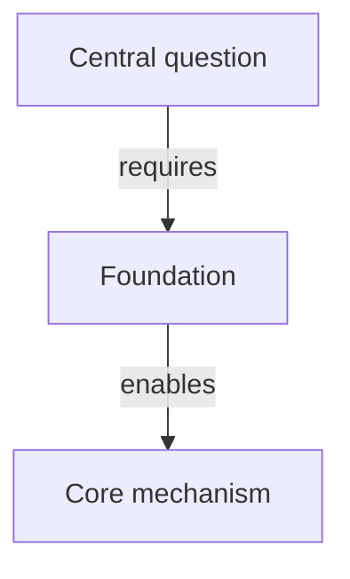

# Interactive Web View

Use this workflow whenever file writing is available. Produce both the durable Markdown source and a self-contained, clickable HTML reader.

## Output contract

1. Write the complete cognitive map to the path requested by the learner, or to `map.md` by default.
2. Inspect an existing target before writing. Update it only when it clearly represents the same map; otherwise choose `<topic>-map.md`.
3. Keep the relationship diagram in a fenced `mermaid` block.
4. Render the companion page with:

   ```sh
   python3 <skill-dir>/scripts/render_map.py <map.md> --output <map.html>
   ```

5. Verify that both files are non-empty and that the renderer exits successfully.
6. Return the HTML link first, followed by the Markdown source link.
7. Open the page in a browser only when the learner explicitly asks to open or launch it.
8. Tell the learner they can reopen it later with `$agents-skills:cognitive-map-open`.

When file writing is unavailable, provide the complete map inline and state that no artifacts were created.

## Diagram conventions

Use the renderer-supported Mermaid subset so the graph becomes interactive:



Declare each node on its own line. Use stable alphanumeric node IDs, quoted labels, and `-->` edges. Put relationship labels between pipes. Avoid Mermaid directives, subgraphs, custom classes, HTML labels, or layout-dependent styling; the web reader supplies its own visual system.

Make graph labels closely match conceptual-spine headings. This lets a selected node offer a direct jump to its full explanation and inherit its `CORE`, `BRANCH`, `ADVANCED`, or `OPTIONAL` classification.

Every graph node must also be explained in the Markdown prose outside the Mermaid block. Prefer using its exact label in a heading, bold term, paragraph, list item, or quotation. The renderer resolves each node to the closest matching content and displays a **Read this concept →** link in the relationship panel. Do not add a visual node that has no corresponding explanation in the file.

## Reader behavior

The bundled renderer is inspired by btw-wiki's local notebook without depending on it. Preserve these capabilities:

- a calm, notebook-like reading view with a collapsible responsive sidebar;
- section navigation and a filterable table of contents;
- full-map command search with `Cmd/Ctrl+K` or `/`;
- a separate relationship graph opened with the Graph tab or `v`;
- clickable graph nodes with incoming and outgoing relationships;
- a content link for every graph node, resolving into the Markdown-derived page;
- hover-based neighbor highlighting and zoom controls;
- direct jumps between graph nodes and conceptual-spine explanations;
- dark and paper-like light themes saved locally;
- per-concept “understood” progress saved in browser local storage;
- a link back to the Markdown source;
- keyboard access, focus states, and reduced-motion support;
- a self-contained HTML file with no network or package-install requirement.

Treat the webpage as the primary learning interface and the Markdown file as its portable source of truth. Do not replace the conceptual map with decorative cards: dependencies, labeled relationships, retrieval cues, branches, misconceptions, and the learning frontier must remain readable in the page.

## Failure handling

- If Python 3 is unavailable, keep the Markdown artifact and explain that the HTML renderer could not run.
- If the graph is empty, correct the Mermaid block and rerun the renderer rather than shipping a non-interactive page.
- If an output path would overwrite unrelated content, choose a descriptive alternative instead.
- Do not add external scripts, fonts, analytics, trackers, or CDN dependencies.
